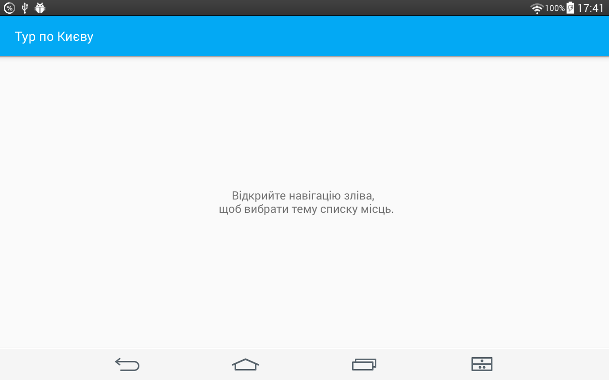
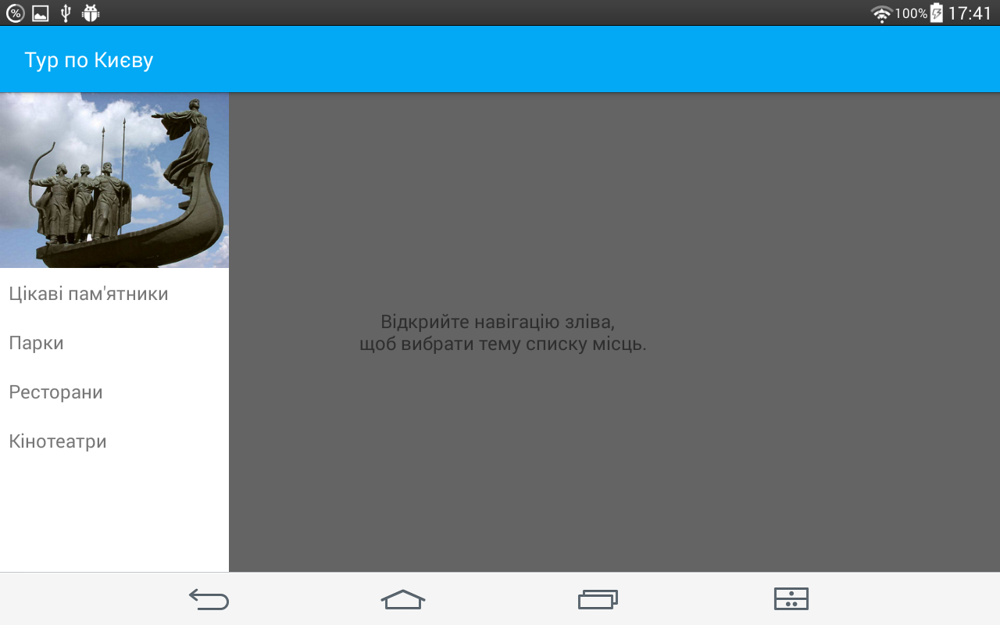
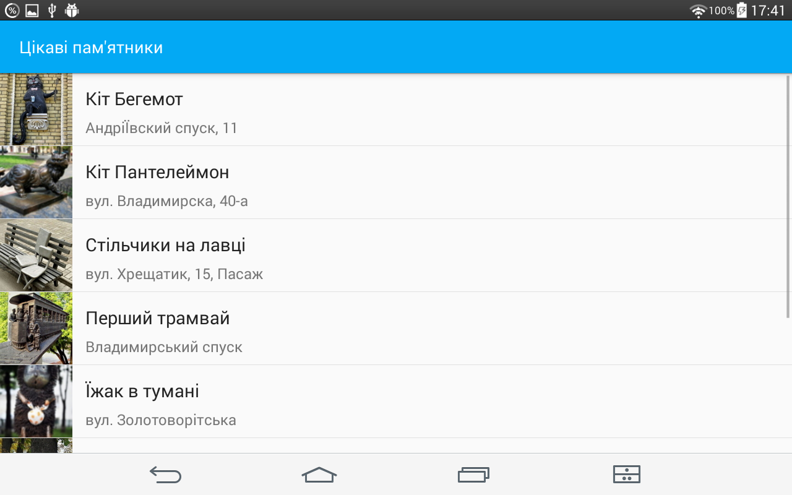
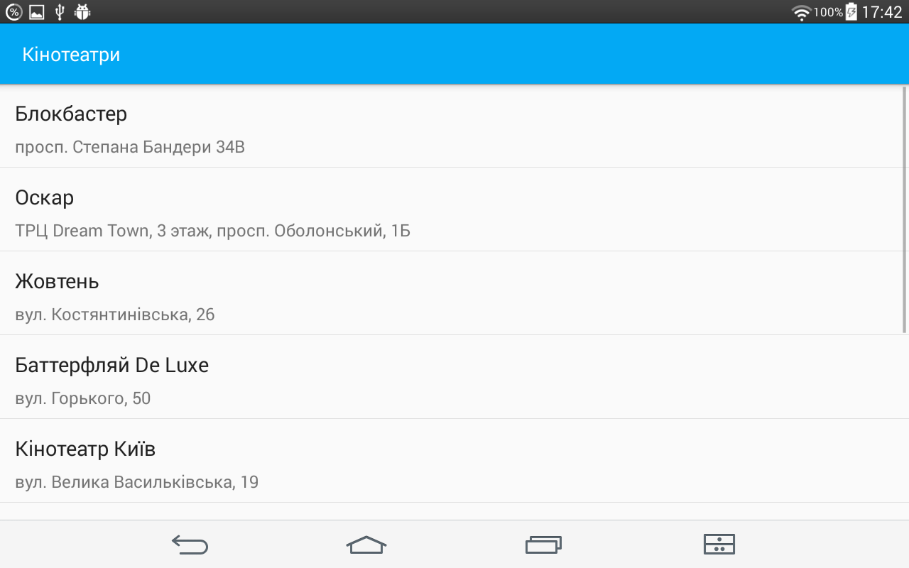

# Kyiv Tour

Sixth task from Udacity's [Android basics course](https://www.udacity.com/course/android-basics-nanodegree-by-google--nd803)

Android Basics: Multiscreen Apps

[Lesson 6: Tour Guide App](https://review.udacity.com/#!/rubrics/161/view)

App contains 4 lists of attractions in Kyiv: parks, monuments, cinemas, and restaurants.

User can navigate between lists using a NavDrawer.

Monuments list includes pictures of the location.

Other lists don't include pictures.

App contains a class Place for storing location information.

App uses a custom adapter PlaceAdapter to populate the layout with views based on instances of the custom class.